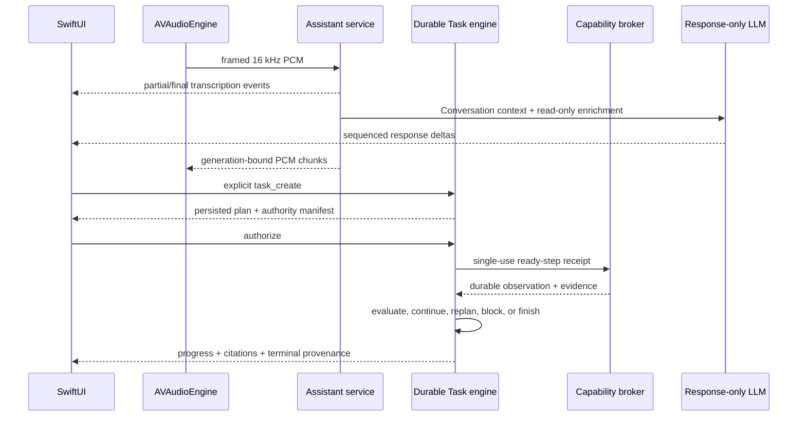

# Architecture

## Ownership

`MacBot.app` is the only user-facing lifecycle and operator owner. It starts one supervised
Python service tree, connects through private Unix sockets, and stops that tree
on Quit. Closing the conversation window does not imply that hands-free capture
has stopped; the menu-bar state remains visible until Stop or Quit.

The optional loopback diagnostics view is a read-only observer of the same
service tree. It is not allowed to create a model, submit turns, capture or play
audio, mutate settings or documents, approve tools, or maintain another history
pipeline.

## Native product state

Connection readiness and turn phase are intentionally separate. The window and
menu bar share `starting`, `ready`, `listening`, `working`, `reconnecting`, and
`blocked` product states. Turn phases such as transcription, planning,
generation, action execution, and speech are shown only while the product is
operational. Controls derive their enabled state from this contract; a missing
IPC client is never presented as a valid no-op action.

The five native destinations are Conversation, Tasks, Library, Diagnostics,
and Settings. The conversation timeline is the chronological transcript. Tasks
is the durable research view of the same sequenced events. Task records
include an ID, turn ID, title, state, detail, authorization source, and an
explicit set of available commands. Live events and atomic `sync` snapshots
both carry that command set. Swift intersects the service-provided commands
with the packaged protocol-v3 legality matrix; missing commands produce
a read-only task instead of synthesized authority.

The composer has two explicit modes. Conversation submits an immediate `chat`
turn and may speak its typed reply according to the native preference. Task
submits `task_create`, persists a bounded plan, and stops at
`awaiting_authorization`. The native client atomically reconciles messages,
Tasks, the active turn, event cursor, and epoch with `sync` whenever the private
service connection is established, an event gap is detected, or the epoch
changes. Task
execution begins only after an explicit `task_command` with `authorize`.

## Turn flow

Every event includes an epoch and increasing sequence number. Reconnection
continues from the last cursor; an epoch change forces a state refresh. Turn IDs
bind transcription, actions, synthesis, cancellation, and UI updates so stale
output cannot enter a newer turn.

Swift is the only released capture and playback transport. One resident
Parakeet recognizer produces one final transcript after endpoint
detection. Listening feedback comes from native capture/VAD activity, not a
second recognizer. Partial transcription is ephemeral and never enters durable
history or the event journal. A capture generation invalidates late audio after
Stop, interruption, endpoint detection, or a new utterance.

The canonical LLM has one request-owned priority lane. Conversation receives the
next available model lease; cancellation can close only the transport owned by
that request. Task planning/finalization are lower priority, while semantic
compaction runs after durable turn completion as background work. Live response
deltas are coalesced to at most 10 Hz and remain ephemeral.

## Native IPC

The control and audio sockets are created in an owner-only runtime directory and
have mode `0600`. The native client opens independent command and event
connections to the control socket. A 256-bit per-launch token is written with
mode `0600`, consumed by the assistant, then unlinked. Every connection authenticates
before accepting requests, events, or PCM. Command and event channels have
independent bounded deadlines, so a long event wait cannot block an Interrupt
or authorization command. Control frames use a four-byte big-endian
length plus JSON and are bounded to 12 MiB for document import. Audio frames use
the same length prefix, a one-byte operation, and bounded float32 PCM payloads.

No token is accepted in a URL, command-line argument, or log. The durable
history key is generated and retained in macOS Keychain. The native app reads
the key and writes its 32 bytes to an inherited private pipe. The CLI passes it
to the supervisor through another inherited pipe, and the supervisor creates a
fresh pipe for each assistant launch or restart. The service never queries
Keychain and never accepts the key through arguments, environment values,
configuration, URLs, or files. During a macOS dark wake, when Security blocks
Keychain UI access, the app shows a waiting state and starts no service tree;
it retries after wake instead of reporting false readiness.

## Persistence and retrieval

Messages, Tasks/steps, authority manifests, and evidence are canonical encrypted
SQLite records. Durable Task events retain only ordered state deltas and
canonical task/revision references; live presentation snapshots are not copied
into the durable journal. Associated data binds ciphertext to its table and row ID.
Retention defaults to 30 days and is enforced by source-record age.
Conversation clear removes messages, summaries, and non-Task events while
retaining the Task ledger.

Document source text and metadata are authoritative in SQLite. Chunk vectors
are normalized MiniLM ONNX embeddings stored in a versioned NumPy file and
searched with exact cosine similarity through a memory map. Batch changes build
one staged revision, verify it, then change the active revision atomically. The
active and two recent verified revisions are retained.

## Trust boundary

The planner's JSON is untrusted until schema, dependency, step budget,
capability, arguments, target scope, and manifest checks pass. Execution starts
only after native Task authorization; receipt consumption and the durable
running marker commit in one transaction before the executor is invoked. Every
step receives a `RequestContext` with task, step, attempt, deadline,
cancellation, and authorization version. Retrieved documents and tool output
can inform evaluation but cannot authorize another action. Material changes to
capability, target, source scope, deadline, or side-effect class return to
authorization. The kernel permits at most 12 executed steps and two replans.
There is no general shell, arbitrary file-write, purchasing, messaging, account
mutation, Pi adapter, or Hermes runtime.
