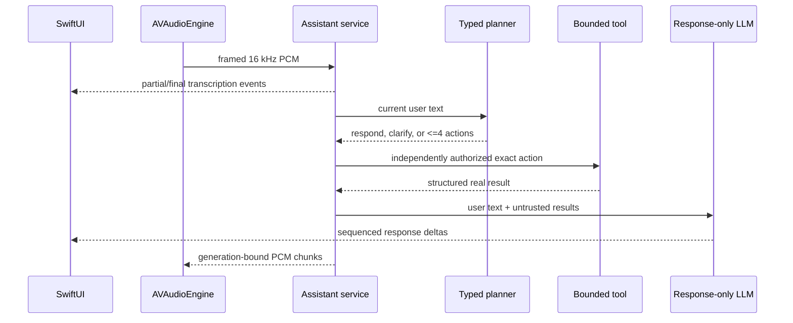

# Architecture

## Ownership

`MacBot.app` is the only user-facing lifecycle owner. It starts one supervised
Python service tree, connects through private Unix sockets, and stops that tree
on Quit. Closing the conversation window does not imply that hands-free capture
has stopped; the menu-bar state remains visible until Stop or Quit.

The dashboard is an authenticated adapter to the same assistant service. It is
not allowed to create a second model, history, capture, or playback pipeline.

## Turn flow

Every event includes an epoch and increasing sequence number. Reconnection
continues from the last cursor; an epoch change forces a state refresh. Turn IDs
bind transcription, actions, synthesis, cancellation, and UI updates so stale
output cannot enter a newer turn.

## Native IPC

The control socket and audio socket are created in an owner-only runtime
directory and have mode `0600`. A 256-bit per-launch token is written with mode
`0600`, consumed by the assistant, then unlinked. Both connections authenticate
before accepting requests or PCM. Control frames use a four-byte big-endian
length plus JSON and are bounded to 12 MiB for document import. Audio frames use
the same length prefix, a one-byte operation, and bounded float32 PCM payloads.

No token is accepted in a URL, command-line argument, or log. The durable
history key is generated and retained in macOS Keychain. The service reads an
existing key without writing it to configuration or logs.

## Persistence and retrieval

Conversation content and task/event payloads are AES-256-GCM encrypted per row
in SQLite. Associated data binds ciphertext to its table and row ID. Retention
defaults to 30 days, secure deletion is enabled, and conversation deletion
removes the selected session.

Document source text and metadata are authoritative in SQLite. Chunk vectors
are normalized MiniLM ONNX embeddings stored in a versioned NumPy file and
searched with exact cosine similarity through a memory map. Rebuilds stage a
new revision, verify document/chunk counts and retrieval, then change the active
revision atomically. The previous revision and migration backup remain intact.

## Trust boundary

The planner's JSON is untrusted until schema, source span, action count, tool,
argument, and explicit-request checks pass. Retrieved documents and tool output
can inform the final answer but cannot authorize another action. There is no
general shell, arbitrary file-write, purchasing, messaging, or account mutation
tool in this release.
