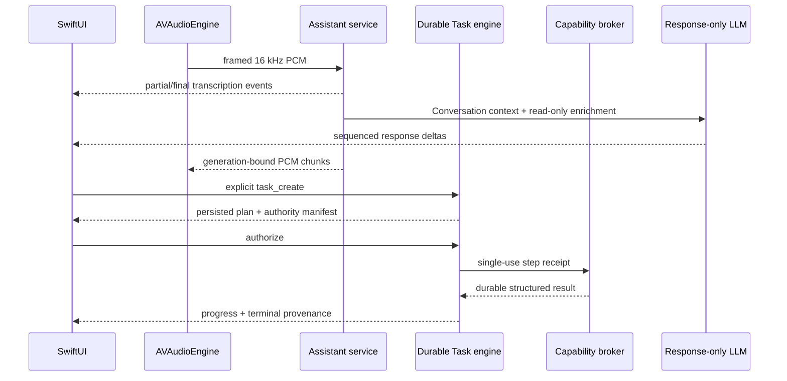

# Architecture

## Ownership

`MacBot.app` is the only user-facing lifecycle and operator owner. It starts one supervised
Python service tree, connects through private Unix sockets, and stops that tree
on Quit. Closing the conversation window does not imply that hands-free capture
has stopped; the menu-bar state remains visible until Stop or Quit.

The optional loopback diagnostics view is a read-only observer of the same
service tree. It is not allowed to create a model, submit turns, capture or play
audio, mutate settings or documents, approve tools, or maintain another history
pipeline.

## Native product state

Connection readiness and turn phase are intentionally separate. The window and
menu bar share `starting`, `ready`, `listening`, `working`, `reconnecting`, and
`blocked` product states. Turn phases such as transcription, planning,
generation, action execution, and speech are shown only while the product is
operational. Controls derive their enabled state from this contract; a missing
IPC client is never presented as a valid no-op action.

The conversation timeline is the chronological transcript. The Task Center is
the durable action-oriented view of the same sequenced events. Task records
include an ID, turn ID, title, state, detail, authorization source, and an
explicit set of available commands. Live events carry that command set. Because
persisted `task_list` records intentionally omit presentation capabilities, the
native client reconstructs only the protocol-defined commands for their exact
canonical state; it never offers a retry or a command outside that state.

The composer has two explicit modes. Conversation submits an immediate `chat`
turn and may speak its typed reply according to the native preference. Task
submits `task_create`, persists a bounded plan, and stops at
`awaiting_authorization`. The Task Center is hydrated with `task_list` whenever
the private service connection is established or its event epoch resets. Task
execution begins only after an explicit `task_command` with `authorize`.

## Turn flow

Every event includes an epoch and increasing sequence number. Reconnection
continues from the last cursor; an epoch change forces a state refresh. Turn IDs
bind transcription, actions, synthesis, cancellation, and UI updates so stale
output cannot enter a newer turn.

While speech is active, a size-one interim queue periodically sends the latest
bounded capture window through the same resident transcriber used for the final
utterance. Interim and final events share one capture/turn ID. A capture epoch
invalidates late work after Stop, interruption, or a new utterance; final audio
is still flushed through the ordered turn queue.

## Native IPC

The control socket and audio socket are created in an owner-only runtime
directory and have mode `0600`. A 256-bit per-launch token is written with mode
`0600`, consumed by the assistant, then unlinked. Both connections authenticate
before accepting requests or PCM. Control frames use a four-byte big-endian
length plus JSON and are bounded to 12 MiB for document import. Audio frames use
the same length prefix, a one-byte operation, and bounded float32 PCM payloads.

No token is accepted in a URL, command-line argument, or log. The durable
history key is generated and retained in macOS Keychain. The native app reads
the key and writes its 32 bytes to an inherited private pipe. The CLI passes it
to the supervisor through another inherited pipe, and the supervisor creates a
fresh pipe for each assistant launch or restart. The service never queries
Keychain and never accepts the key through arguments, environment values,
configuration, URLs, or files. During a macOS dark wake, when Security blocks
Keychain UI access, the app shows a waiting state and starts no service tree;
it retries after wake instead of reporting false readiness.

## Persistence and retrieval

Conversation content and task/event payloads are AES-256-GCM encrypted per row
in SQLite. Associated data binds ciphertext to its table and row ID. Retention
defaults to 30 days and is enforced by record age. Conversation clear removes
messages, summaries, and non-Task events while retaining the Task ledger.

Document source text and metadata are authoritative in SQLite. Chunk vectors
are normalized MiniLM ONNX embeddings stored in a versioned NumPy file and
searched with exact cosine similarity through a memory map. Batch changes build
one staged revision, verify it, then change the active revision atomically. The
active and two recent verified revisions are retained.

## Trust boundary

The planner's JSON is untrusted until schema, step budget, capability, arguments,
target scope, and manifest checks pass. Execution starts only after native Task
authorization; every step consumes a receipt bound to its durable identity and
normalized arguments. Retrieved documents and tool output can inform evaluation
but cannot authorize another action. There is no general shell, arbitrary
file-write, purchasing, messaging, or account mutation capability.
